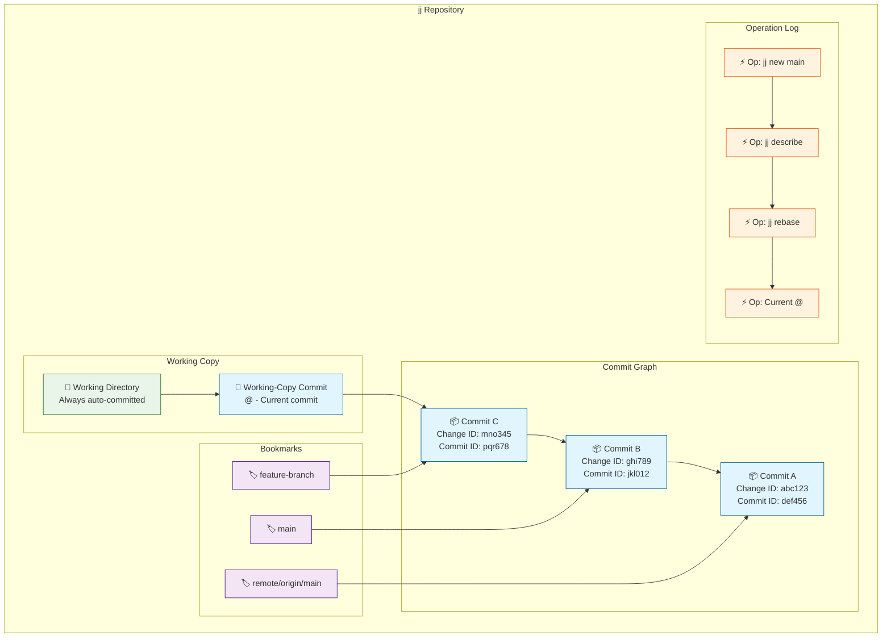
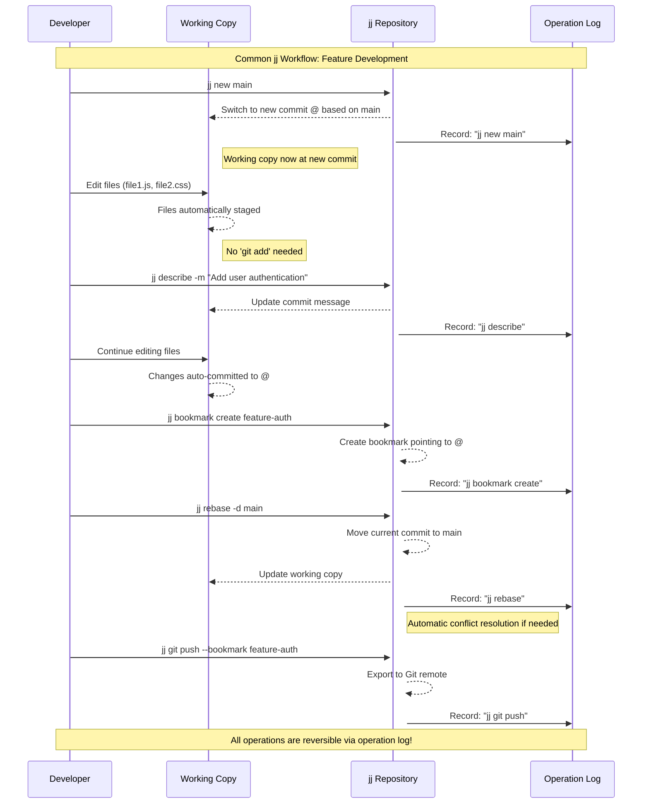

# A Short Guide to Jujutsu for Impatient Git Users

## Motivation

Jujutsu (jj) is a next-generation version control system that addresses several pain points Git users face daily:

**Problems jj Solves:**

- **No staging area confusion** - Work directly with commits, no `git add` complexity.
- **Automatic conflict resolution workflow** - No need for edit, `git rebase --continue` loop.
- **Safe history rewriting** - Rebase/amend operations can't lose work.
- **Lock-free concurrency** - Multiple operations can run simultaneously.
- **Unified mental model** - One consistent way to handle all operations.

**Key Benefits:**

- Every operation is reversible via the operation log.
- Commits are automatically rebased when their parents change.
- Conflicts are stored as first-class objects in commits.
- Working copy changes are automatically committed.

## Conceptual Documentation

Jujutsu currently works as a compatible layer on top of a Git repository. This
eases adoption, but can cause some confusion. For example, to ignore files in
`jj`, one must add them to `.gitignore` since there is no `.jjignore` (yet).

### Core Abstractions

#### Changes
Logical sets of content modifications (including addition and deletion)
comprised of one or more commits which has a stable identifier (change id) that
points to the latest commit.

#### Commits
Immutable snapshots with content based hash commit IDs (like Git).

#### Working Copy
The current state of the content (files) which always corresponds to a commit.
Most `jj` commands automatically commit any pending differences from the prior
commit. This eliminates the need for a separate index or staging area, as well
as the need to `add` to that index explicitly. New files are tracked by default.

#### Bookmarks
Mutable pointers to commits that automatically move with rewrites. Similar to
branches in other VCSs. They can be setup to track remote bookmarks.

#### Operation Log
Records every repository operation, enabling undo/redo.
Provides lock-free concurrency.

### Questions

1. With Git, it is possible to stage partial changes for the next commit by selectively adding those changes to the index. This can be done with `git add -p` or `git add -i`. How is the equivalent operation performed with `jj`?
2. Changes are sets of commits with a stable id. So are bookmarks. Beside the fact that bookmarks have names and can track remote bookmarks, what other differences do they have?
3. What is the difference between the (operation) log and the evolog?



### Primary Operations

- **`jj new`** - Create new commit (replaces `git checkout -b`)
- **`jj edit`** - Switch to editing a commit (replaces `git checkout`)
- **`jj describe`** - Change commit message (replaces `git commit --amend`)
- **`jj abandon`** - Delete commits (replaces `git reset --hard`)
- **`jj rebase`** - Move commits (like `git rebase` but safer)

### Using jj With and Without Git

**With Git (Co-located Repository):**
- jj and Git repos share the same `.git` directory
- Use `jj git import/export` to sync between jj and Git
- Can use Git tools alongside jj commands
- Push/pull through jj's Git integration

**Without Git (Pure jj Repository):**
- Native jj storage format
- All features available without Git compatibility layer
- Can still push to Git remotes when needed

## Check Your Understanding: Concepts

**Question 1:** What is the key difference between jj's change IDs and Git's commit hashes?
<details>
<summary>Click to reveal answer</summary>

Change IDs remain constant through rewrites (like amend, rebase), while Git commit hashes change with every modification. This means you can reliably refer to a logical change even after rewriting its history.
</details>

**Question 2:** In jj, what happens when you edit files in your working directory?
<details>
<summary>Click to reveal answer</summary>

Files are automatically staged and committed to the current working-copy commit (@). There's no staging area or need for `git add` - changes are immediately part of the commit.
</details>

**Question 3:** How do bookmarks differ from Git branches in terms of behavior during rewrites?
<details>
<summary>Click to reveal answer</summary>

Bookmarks automatically move to follow commits when they're rewritten (rebased, amended, etc.), whereas Git branches can become orphaned or point to old commit hashes after rewrites.
</details>

**Question 4:** What is the operation log and why is it important?
<details>
<summary>Click to reveal answer</summary>

The operation log records every command that modifies the repository, enabling undo/redo of any operation and providing lock-free concurrency. It makes every jj operation reversible.
</details>

## Tutorial: Adding jj to an Existing Git Repository

### 1. Initialize jj in Git Repository

```bash
# Run this command in your existing Git repo to co-locate jj with Git. This also imports git history.
jj git init --colocate

```

### 2. Basic Workflow Examples

**Create and Switch Between Commits:**
```bash
# Create new commit based on main
jj new main
# Edit files - they're automatically in this commit

# Switch to different commit
jj new some-feature
# Your working copy changes were auto-committed to previous commit
```

**Handle Conflicts:**
```bash
# If rebase creates conflicts, jj stores them in the commit
jj rebase -d main
# Edit conflict markers in files, then:
jj describe -m "Resolved conflicts"
```

**Manage History:**
```bash
# View history
jj log

# Rewrite commit message
jj describe -r @- -m "Better message"

# Move commits around
jj rebase -r @ -d main

# Abandon unwanted commits
jj abandon badcommit
```

### 3. Git Integration

**Sync with Git:**
```bash
# Pull changes from Git remote
jj git fetch

# Push jj bookmarks to Git
jj git push

# Import new Git branches
jj git import
```

**Complete Workflow Visualization:**



## Check Your Understanding: Tutorial

**Question 1:** After running `jj git init --colocate` in an existing Git repo, what additional step is needed to access Git's history in jj?
<details>
<summary>Click to reveal answer</summary>

Run `jj git import` to import the existing Git history as jj commits and bookmarks.
</details>

**Question 2:** When you run `jj new main` and then edit files, where are those changes stored?
<details>
<summary>Click to reveal answer</summary>

The changes are automatically committed to the new working-copy commit (@) that was created based on main. No explicit commit command is needed.
</details>

**Question 3:** If you run `jj new some-feature` after making changes, what happens to your uncommitted work?
<details>
<summary>Click to reveal answer</summary>

jj automatically commits your changes to the previous working-copy commit before switching to the new commit. You never lose work when switching commits.
</details>

**Question 4:** How does jj handle conflicts differently from Git during a rebase operation?
<details>
<summary>Click to reveal answer</summary>

jj stores conflicts as first-class objects within commits rather than blocking the operation. You can continue working and resolve conflicts later, or even commit conflicted states.
</details>

**Question 5:** What's the command equivalent to `git push origin feature-branch` in jj?
<details>
<summary>Click to reveal answer</summary>

`jj git push --bookmark feature-branch` (assuming you've created a bookmark named feature-branch pointing to your changes).
</details>

## Reference: Essential Commands

### Repository Operations
- `jj init --git` - Create new jj repo with Git backend
- `jj git init --colocate` - Add jj to existing Git repo
- `jj status` - Show working copy status
- `jj log` - View commit history

### Commit Operations
- `jj new [REVISION]` - Create new commit (default: current commit)
- `jj edit REVISION` - Switch to editing specific commit
- `jj describe [-r REVISION] [-m MESSAGE]` - Change commit description
- `jj abandon REVISION` - Remove commits from history

### History Manipulation
- `jj rebase -r REVISION -d DESTINATION` - Move commits
- `jj squash` - Merge current commit into parent
- `jj split` - Split commit into multiple commits
- `jj duplicate REVISION` - Create copy of commits

### Bookmark Management
- `jj bookmark create NAME [REVISION]` - Create new bookmark
- `jj bookmark set NAME REVISION` - Move bookmark to commit
- `jj bookmark list` - Show all bookmarks
- `jj bookmark delete NAME` - Remove bookmark

### Git Integration
- `jj git fetch [--remote REMOTE]` - Fetch from Git remote
- `jj git push [--bookmark NAME]` - Push to Git remote
- `jj git import` - Import Git refs as bookmarks
- `jj git export` - Export jj changes to underlying Git repo

### Operation Log
- `jj operation log` - View operation history
- `jj operation undo [OPERATION]` - Undo operation
- `jj operation restore OPERATION` - Restore to specific operation

## Resources

### Official Documentation
- **Concepts**: https://jj-vcs.github.io/jj/latest/
- **CLI Reference**: https://jj-vcs.github.io/jj/latest/cli-reference/
- **Git Comparison**: https://jj-vcs.github.io/jj/latest/git-comparison/
- **Tutorial**: https://jj-vcs.github.io/jj/latest/tutorial/

### Written Tutorials
- **Chris Krycho's "jj init"**: https://v5.chriskrycho.com/essays/jj-init/
- **Steve Klabnik's Jujutsu Tutorial**: https://steveklabnik.github.io/jujutsu-tutorial/

### Video Tutorials
*Note: Video URLs are current as of August 14, 2025, and may change over time.*

- **[Chris Krycho's Jujutsu YouTube Series](https://www.youtube.com/results?search_query=Chris+Krycho+Jujutsu)** - Started March 2024, comprehensive coverage from an experienced user
- **[GitButler "Bits and Booze" - Jujutsu Episode](https://www.youtube.com/results?search_query=GitButler+Bits+Booze+Jujutsu)** - Educational walkthrough of Jujutsu concepts
- **[Martin von Zweigbergk's Git Merge 2022 Talk](https://www.youtube.com/results?search_query=Martin+von+Zweigbergk+Jujutsu+Git+Merge+2022)** - Official presentation by Jujutsu's creator

*For additional tutorials, search YouTube for "Jujutsu jj version control" or browse the official GitButler and GitHub channels.*
